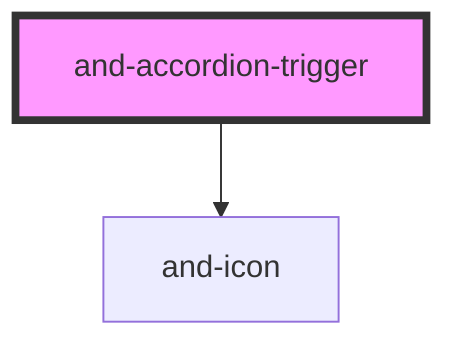

# and-accordion-content

<!-- Auto Generated Below -->

## Methods

### `setItemProps(props: TriggerItemProps) => Promise<void>`

Receive item properties from parent accordion-item.

#### Parameters

| Name    | Type               | Description |
| ------- | ------------------ | ----------- |
| `props` | `TriggerItemProps` |             |

#### Returns

Type: `Promise<void>`

## Dependencies

### Depends on

- [and-icon](../and-icon)

### Graph

----------------------------------------------

*Built with [StencilJS](https://stenciljs.com/)*
