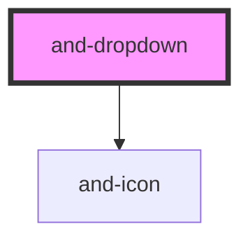

# and-dropdown

<!-- Auto Generated Below -->

## Properties

| Property        | Attribute         | Description | Type                                     | Default     |
| --------------- | ----------------- | ----------- | ---------------------------------------- | ----------- |
| `closeOnSelect` | `close-on-select` |             | `boolean`                                | `true`      |
| `items`         | --                |             | `DropdownItem[]`                         | `[]`        |
| `label`         | `label`           |             | `string`                                 | `'Options'` |
| `placement`     | `placement`       |             | `"bottom" \| "left" \| "right" \| "top"` | `'bottom'`  |
| `variant`       | `variant`         |             | `any`                                    | `'default'` |

## Events

| Event            | Description | Type                  |
| ---------------- | ----------- | --------------------- |
| `dropdownSelect` |             | `CustomEvent<string>` |

## Dependencies

### Depends on

- [and-icon](../and-icon)

### Graph

----------------------------------------------

*Built with [StencilJS](https://stenciljs.com/)*
