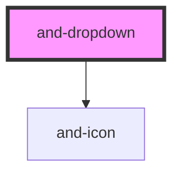

# and-dropdown

<!-- Auto Generated Below -->

## Properties

| Property        | Attribute         | Description                                          | Type                                                            | Default     |
| --------------- | ----------------- | ---------------------------------------------------- | --------------------------------------------------------------- | ----------- |
| `closeOnSelect` | `close-on-select` | Whether to close the menu after an item is selected. | `boolean`                                                       | `true`      |
| `items`         | --                | Items to render in the dropdown menu.                | `DropdownItem[]`                                                | `[]`        |
| `label`         | `label`           | Accessible label for the dropdown trigger.           | `string`                                                        | `'Options'` |
| `placement`     | `placement`       | Preferred placement of the dropdown menu.            | `"bottom" \| "left" \| "right" \| "top"`                        | `'bottom'`  |
| `variant`       | `variant`         | Visual variant of the trigger button.                | `"default" \| "ghost" \| "outline" \| "primary" \| "secondary"` | `'default'` |

## Events

| Event                   | Description                                   | Type                   |
| ----------------------- | --------------------------------------------- | ---------------------- |
| `andDropdownOpenChange` | Emitted when the dropdown open state changes. | `CustomEvent<boolean>` |
| `andDropdownSelect`     | Emitted when an item is selected.             | `CustomEvent<string>`  |

## Dependencies

### Depends on

- [and-icon](../and-icon)

### Graph

----------------------------------------------

*Built with [StencilJS](https://stenciljs.com/)*
