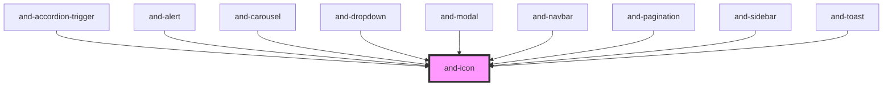

# and-icon

<!-- Auto Generated Below -->

## Properties

| Property      | Attribute      | Description                                                                          | Type                    | Default          |
| ------------- | -------------- | ------------------------------------------------------------------------------------ | ----------------------- | ---------------- |
| `color`       | `color`        | The color of the icon (default: currentColor)                                        | `string`                | `'currentColor'` |
| `name`        | `name`         | The name of the icon to render. Must be previously registered via `registerIcons()`. | `string \| string & {}` | `undefined`      |
| `size`        | `size`         | The size of the icon in pixels (default: 24)                                         | `number \| string`      | `24`             |
| `strokeWidth` | `stroke-width` | Stroke width (default: 2)                                                            | `number \| string`      | `2`              |

## Dependencies

### Used by

 - [and-accordion-trigger](../and-accordion)
 - [and-alert](../and-alert)
 - [and-carousel](../and-carousel)
 - [and-dropdown](../and-dropdown)
 - [and-modal](../and-modal)
 - [and-navbar](../and-navbar)
 - [and-pagination](../and-pagination)
 - [and-sidebar](../and-sidebar)
 - [and-toast](../and-toast)

### Graph

----------------------------------------------

*Built with [StencilJS](https://stenciljs.com/)*
