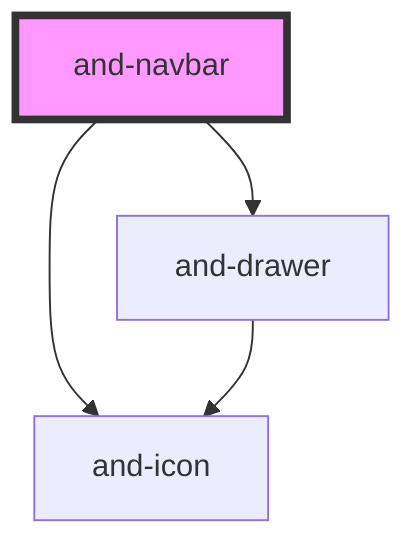

# and-navbar

<!-- Auto Generated Below -->

## Properties

| Property          | Attribute           | Description                                                                                                                                                                                           | Type                               | Default             |
| ----------------- | ------------------- | ----------------------------------------------------------------------------------------------------------------------------------------------------------------------------------------------------- | ---------------------------------- | ------------------- |
| `activeItem`      | `active-item`       | The active navigation item ID. Reflects the headless‐core state.                                                                                                                                      | `string`                           | `''`                |
| `ariaNavLabel`    | `aria-nav-label`    | ARIA label for the navigation                                                                                                                                                                         | `string`                           | `'Main navigation'` |
| `items`           | `items`             | Navigation items to display. When provided, the component renders its own items (with full keyboard navigation, scroll-spy, and active‐indicator). When empty, use the `nav` slot for custom content. | `NavItem[] \| string`              | `[]`                |
| `position`        | `position`          | Positioning behaviour                                                                                                                                                                                 | `"fixed" \| "static" \| "sticky"`  | `'static'`          |
| `scrollSpy`       | `scroll-spy`        | Enable scroll-spy (auto-detect active section by scroll position). Items must have `href` starting with `#`.                                                                                          | `boolean`                          | `false`             |
| `scrollSpyOffset` | `scroll-spy-offset` | Scroll-spy offset from the top of viewport (px).                                                                                                                                                      | `number`                           | `100`               |
| `variant`         | `variant`           | Visual variant                                                                                                                                                                                        | `"default" \| "filled" \| "ghost"` | `'default'`         |

## Events

| Event              | Description                               | Type                                         |
| ------------------ | ----------------------------------------- | -------------------------------------------- |
| `mobileMenuChange` | Emitted when mobile menu state changes    | `CustomEvent<boolean>`                       |
| `navItemClick`     | Emitted when active item changes          | `CustomEvent<string>`                        |
| `navLinkClick`     | Emitted when a navigation link is clicked | `CustomEvent<{ id: string; href: string; }>` |

## Dependencies

### Depends on

- [and-icon](../and-icon)
- [and-drawer](../and-drawer)

### Graph

----------------------------------------------

*Built with [StencilJS](https://stenciljs.com/)*
