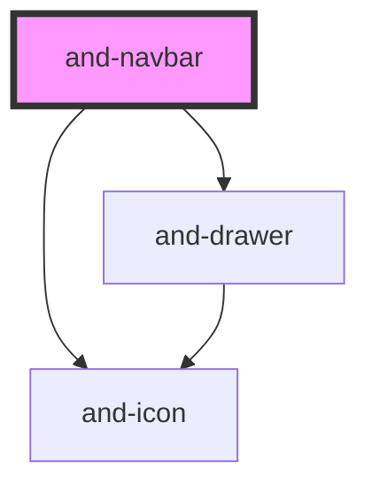

# and-navbar

<!-- Auto Generated Below -->

## Properties

| Property     | Attribute     | Description                   | Type                   | Default                                                                                                                                                           |
| ------------ | ------------- | ----------------------------- | ---------------------- | ----------------------------------------------------------------------------------------------------------------------------------------------------------------- |
| `activeItem` | `active-item` | The active navigation item ID | `string`               | `'home'`                                                                                                                                                          |
| `items`      | --            | Navigation items to display   | `NavItem[]`            | `[     { id: 'home', label: 'Home' },     { id: 'docs', label: 'Docs' },     { id: 'components', label: 'Components' },     { id: 'icons', label: 'Icons' },   ]` |
| `variant`    | `variant`     | Variant of the navbar         | `"default" \| "ghost"` | `'default'`                                                                                                                                                       |

## Events

| Event          | Description                               | Type                  |
| -------------- | ----------------------------------------- | --------------------- |
| `navItemClick` | Emitted when a navigation item is clicked | `CustomEvent<string>` |

## Dependencies

### Depends on

- [and-icon](../and-icon)
- [and-drawer](../and-drawer)

### Graph

----------------------------------------------

*Built with [StencilJS](https://stenciljs.com/)*
