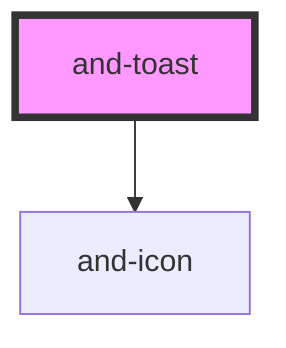

# and-toast

<!-- Auto Generated Below -->

## Methods

### `present(message: string, type?: ToastType, duration?: number) => Promise<any>`

Present a new toast

#### Parameters

| Name       | Type                                                       | Description |
| ---------- | ---------------------------------------------------------- | ----------- |
| `message`  | `string`                                                   |             |
| `type`     | `"info" \| "error" \| "default" \| "success" \| "warning"` |             |
| `duration` | `number`                                                   |             |

#### Returns

Type: `Promise<any>`

## Dependencies

### Depends on

- [and-icon](../and-icon)

### Graph

----------------------------------------------

*Built with [StencilJS](https://stenciljs.com/)*
