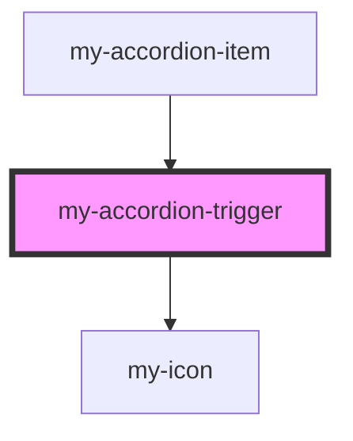

# my-accordion-content

<!-- Auto Generated Below -->

## Properties

| Property | Attribute | Description                         | Type      | Default     |
| -------- | --------- | ----------------------------------- | --------- | ----------- |
| `open`   | `open`    | OPEN STATE (Managed by parent item) | `boolean` | `false`     |
| `value`  | `value`   | Value of the item                   | `string`  | `undefined` |

## Events

| Event                   | Description | Type                  |
| ----------------------- | ----------- | --------------------- |
| `accordionTriggerClick` |             | `CustomEvent<string>` |

## Dependencies

### Used by

 - [my-accordion-item](.)

### Depends on

- [my-icon](../my-icon)

### Graph

----------------------------------------------

*Built with [StencilJS](https://stenciljs.com/)*
