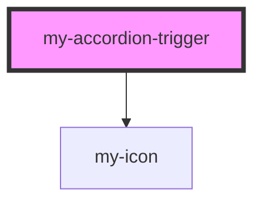

# my-accordion-content

<!-- Auto Generated Below -->

## Overview

Accordion trigger/header component

## Methods

### `setItemProps(props: { itemId: string; accordionLogic: AccordionReturn; disabled?: boolean; }) => Promise<void>`

Set item properties from parent

#### Parameters

| Name    | Type                                                                       | Description |
| ------- | -------------------------------------------------------------------------- | ----------- |
| `props` | `{ itemId: string; accordionLogic: AccordionReturn; disabled?: boolean; }` |             |

#### Returns

Type: `Promise<void>`

## Dependencies

### Depends on

- [my-icon](../my-icon)

### Graph

----------------------------------------------

*Built with [StencilJS](https://stenciljs.com/)*
