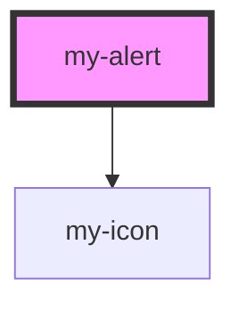

# my-alert

<!-- Auto Generated Below -->

## Properties

| Property      | Attribute     | Description | Type                                                             | Default     |
| ------------- | ------------- | ----------- | ---------------------------------------------------------------- | ----------- |
| `dismissible` | `dismissible` |             | `boolean`                                                        | `false`     |
| `variant`     | `variant`     |             | `"default" \| "destructive" \| "info" \| "success" \| "warning"` | `'default'` |

## Events

| Event       | Description | Type                |
| ----------- | ----------- | ------------------- |
| `myDismiss` |             | `CustomEvent<void>` |

## Dependencies

### Depends on

- [my-icon](../my-icon)

### Graph

----------------------------------------------

*Built with [StencilJS](https://stenciljs.com/)*
