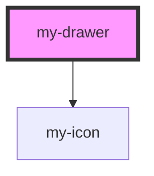

# my-drawer

<!-- Auto Generated Below -->

## Properties

| Property    | Attribute   | Description                              | Type                                     | Default  |
| ----------- | ----------- | ---------------------------------------- | ---------------------------------------- | -------- |
| `open`      | `open`      | Whether the drawer is open.              | `boolean`                                | `false`  |
| `placement` | `placement` | The direction the drawer slides in from. | `"bottom" \| "left" \| "right" \| "top"` | `'left'` |

## Events

| Event     | Description                                                         | Type                |
| --------- | ------------------------------------------------------------------- | ------------------- |
| `myClose` | Emitted when the drawer is closed (backdrop click or close button). | `CustomEvent<void>` |

## Dependencies

### Depends on

- [my-icon](../my-icon)

### Graph

----------------------------------------------

*Built with [StencilJS](https://stenciljs.com/)*
