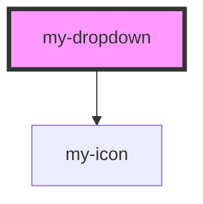

# my-dropdown

<!-- Auto Generated Below -->

## Properties

| Property  | Attribute | Description | Type             | Default     |
| --------- | --------- | ----------- | ---------------- | ----------- |
| `items`   | --        |             | `DropdownItem[]` | `[]`        |
| `label`   | `label`   |             | `string`         | `'Options'` |
| `variant` | `variant` |             | `any`            | `'default'` |

## Events

| Event            | Description | Type                  |
| ---------------- | ----------- | --------------------- |
| `dropdownSelect` |             | `CustomEvent<string>` |

## Dependencies

### Depends on

- [my-icon](../my-icon)

### Graph

----------------------------------------------

*Built with [StencilJS](https://stenciljs.com/)*
