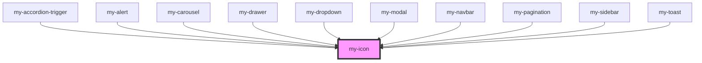

# my-icon

<!-- Auto Generated Below -->

## Properties

| Property      | Attribute      | Description                                   | Type                                                                                                                                                                                                                                                                                                                                                                                                                                                                                                                                                                                                              | Default          |
| ------------- | -------------- | --------------------------------------------- | ----------------------------------------------------------------------------------------------------------------------------------------------------------------------------------------------------------------------------------------------------------------------------------------------------------------------------------------------------------------------------------------------------------------------------------------------------------------------------------------------------------------------------------------------------------------------------------------------------------------- | ---------------- |
| `color`       | `color`        | The color of the icon (default: currentColor) | `string`                                                                                                                                                                                                                                                                                                                                                                                                                                                                                                                                                                                                          | `'currentColor'` |
| `name`        | `name`         | The name of the icon to render                | `"accessibility" \| "activity" \| "arrow-down" \| "arrow-left" \| "arrow-right" \| "arrow-up" \| "bell" \| "box" \| "chevron-down" \| "chevron-left" \| "chevron-right" \| "chevron-up" \| "close" \| "code" \| "error" \| "eye" \| "eye-off" \| "file-text" \| "home" \| "image" \| "info" \| "layers" \| "layout" \| "list" \| "list-ordered" \| "loader" \| "lock" \| "maximize" \| "menu" \| "message-square" \| "minimize" \| "moon" \| "mouse-pointer" \| "move-horizontal" \| "play" \| "pointer" \| "rotate-ccw" \| "rotate-cw" \| "settings" \| "sliders" \| "star" \| "sun" \| "toggle-left" \| "user"` | `undefined`      |
| `size`        | `size`         | The size of the icon (default: 24)            | `number \| string`                                                                                                                                                                                                                                                                                                                                                                                                                                                                                                                                                                                                | `24`             |
| `strokeWidth` | `stroke-width` | Stroke width (default: 2)                     | `number \| string`                                                                                                                                                                                                                                                                                                                                                                                                                                                                                                                                                                                                | `2`              |

## Dependencies

### Used by

 - [my-accordion-trigger](../my-accordion)
 - [my-alert](../my-alert)
 - [my-carousel](../my-carousel)
 - [my-drawer](../my-drawer)
 - [my-dropdown](../my-dropdown)
 - [my-modal](../my-modal)
 - [my-navbar](../my-navbar)
 - [my-pagination](../my-pagination)
 - [my-sidebar](../my-sidebar)
 - [my-toast](../my-toast)

### Graph

----------------------------------------------

*Built with [StencilJS](https://stenciljs.com/)*
