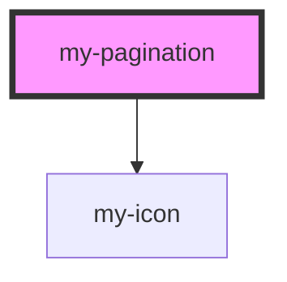

# my-pagination

<!-- Auto Generated Below -->

## Properties

| Property      | Attribute      | Description           | Type     | Default |
| ------------- | -------------- | --------------------- | -------- | ------- |
| `currentPage` | `current-page` | current page number   | `number` | `1`     |
| `totalPages`  | `total-pages`  | total number of pages | `number` | `1`     |

## Events

| Event        | Description               | Type                  |
| ------------ | ------------------------- | --------------------- |
| `pageChange` | Emitted when page changes | `CustomEvent<number>` |

## Dependencies

### Depends on

- [my-icon](../my-icon)

### Graph

----------------------------------------------

*Built with [StencilJS](https://stenciljs.com/)*
