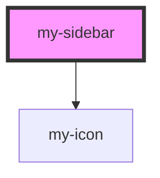

# my-sidebar

<!-- Auto Generated Below -->

## Properties

| Property     | Attribute     | Description                      | Type            | Default                                                                                                                      |
| ------------ | ------------- | -------------------------------- | --------------- | ---------------------------------------------------------------------------------------------------------------------------- |
| `activeItem` | `active-item` | The active navigation item ID    | `string`        | `'home'`                                                                                                                     |
| `collapsed`  | `collapsed`   | Whether the sidebar is collapsed | `boolean`       | `false`                                                                                                                      |
| `items`      | --            | Navigation items to display      | `SidebarItem[]` | `[     { id: 'home', label: 'Home' },     { id: 'docs', label: 'Docs' },     { id: 'components', label: 'Components' },   ]` |

## Events

| Event              | Description                                     | Type                   |
| ------------------ | ----------------------------------------------- | ---------------------- |
| `sidebarItemClick` | Emitted when a navigation item is clicked       | `CustomEvent<string>`  |
| `sidebarToggle`    | Emitted when the sidebar collapse state changes | `CustomEvent<boolean>` |

## Dependencies

### Depends on

- [my-icon](../my-icon)

### Graph

----------------------------------------------

*Built with [StencilJS](https://stenciljs.com/)*
