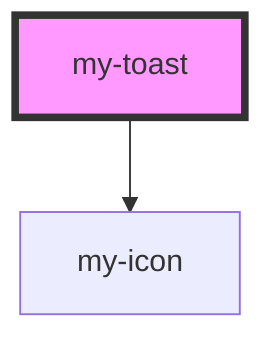

# my-toast

<!-- Auto Generated Below -->

## Methods

### `present(message: string, type?: ToastType, duration?: number) => Promise<void>`

Present a new toast

#### Parameters

| Name       | Type                                          | Description |
| ---------- | --------------------------------------------- | ----------- |
| `message`  | `string`                                      |             |
| `type`     | `"info" \| "error" \| "success" \| "warning"` |             |
| `duration` | `number`                                      |             |

#### Returns

Type: `Promise<void>`

## Dependencies

### Depends on

- [my-icon](../my-icon)

### Graph

----------------------------------------------

*Built with [StencilJS](https://stenciljs.com/)*
