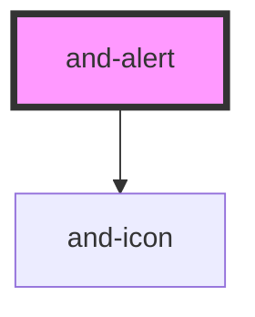

# and-alert

<!-- Auto Generated Below -->

## Properties

| Property      | Attribute     | Description                         | Type                                                             | Default     |
| ------------- | ------------- | ----------------------------------- | ---------------------------------------------------------------- | ----------- |
| `dismissible` | `dismissible` | Whether the alert can be dismissed. | `boolean`                                                        | `false`     |
| `variant`     | `variant`     | Visual variant of the alert.        | `"default" \| "destructive" \| "info" \| "success" \| "warning"` | `'default'` |

## Events

| Event        | Description                          | Type                |
| ------------ | ------------------------------------ | ------------------- |
| `andDismiss` | Emitted when the alert is dismissed. | `CustomEvent<void>` |

## Dependencies

### Depends on

- [and-icon](../and-icon)

### Graph

----------------------------------------------

*Built with [StencilJS](https://stenciljs.com/)*
