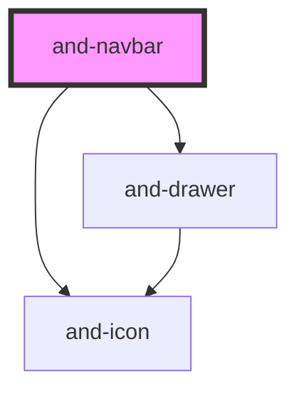

# and-navbar

<!-- Auto Generated Below -->

## Properties

| Property            | Attribute            | Description                                                                                                                                                                                                                                                         | Type                                             | Default             |
| ------------------- | -------------------- | ------------------------------------------------------------------------------------------------------------------------------------------------------------------------------------------------------------------------------------------------------------------- | ------------------------------------------------ | ------------------- |
| `activeItem`        | `active-item`        | The active navigation item ID. Reflects the headless‐core state.                                                                                                                                                                                                    | `string`                                         | `''`                |
| `ariaNavLabel`      | `aria-nav-label`     | ARIA label for the navigation                                                                                                                                                                                                                                       | `string`                                         | `'Main navigation'` |
| `autoCollapse`      | `auto-collapse`      | When `true`, the navbar automatically detects when the nav items overflow and switches to a smaller responsive stage regardless of breakpoints. Content-aware collapse.                                                                                             | `boolean`                                        | `true`              |
| `compactBreakpoint` | `compact-breakpoint` | Breakpoint (px) below which the end section enters compact mode (icon-only, labels hidden). Main nav is still visible.                                                                                                                                              | `number`                                         | `1024`              |
| `itemVariant`       | `item-variant`       | Visual style for individual nav links. Controls how each link looks, independent of the navbar container variant.  - `default`   — subtle rounded pill with hover bg - `underline`  — bottom-border indicator on active - `filled`     — solid primary bg on active | `"default" \| "filled" \| "underline"`           | `'default'`         |
| `items`             | `items`              | Navigation items to display. When provided, the component renders its own items (with full keyboard navigation, scroll-spy, and active‐indicator). When empty, use the `nav` slot for custom content.                                                               | `NavItem[] \| string`                            | `[]`                |
| `minimalBreakpoint` | `minimal-breakpoint` | Breakpoint (px) below which the main (nav links) section is hidden and the navigation moves to the hamburger drawer. Only start + compact end are visible.                                                                                                          | `number`                                         | `768`               |
| `mobileBreakpoint`  | `mobile-breakpoint`  | Breakpoint (px) below which the navbar switches to mobile mode (hamburger menu). Set to `0` to always show desktop, or a high value to always show mobile.                                                                                                          | `number`                                         | `640`               |
| `position`          | `position`           | Positioning behaviour                                                                                                                                                                                                                                               | `"fixed" \| "static" \| "sticky"`                | `'static'`          |
| `scrollSpy`         | `scroll-spy`         | Enable scroll-spy (auto-detect active section by scroll position). Items must have `href` starting with `#`.                                                                                                                                                        | `boolean`                                        | `false`             |
| `scrollSpyOffset`   | `scroll-spy-offset`  | Scroll-spy offset from the top of viewport (px).                                                                                                                                                                                                                    | `number`                                         | `100`               |
| `variant`           | `variant`            | Visual variant                                                                                                                                                                                                                                                      | `"default" \| "filled" \| "floating" \| "glass"` | `'default'`         |

## Events

| Event                   | Description                               | Type                                                        |
| ----------------------- | ----------------------------------------- | ----------------------------------------------------------- |
| `mobileMenuChange`      | Emitted when mobile menu state changes    | `CustomEvent<boolean>`                                      |
| `navItemClick`          | Emitted when active item changes          | `CustomEvent<string>`                                       |
| `navLinkClick`          | Emitted when a navigation link is clicked | `CustomEvent<{ id: string; href: string; }>`                |
| `responsiveStageChange` | Emitted when responsive stage changes     | `CustomEvent<"compact" \| "full" \| "minimal" \| "mobile">` |

## Dependencies

### Depends on

- [and-icon](../and-icon)
- [and-drawer](../and-drawer)

### Graph

----------------------------------------------

*Built with [StencilJS](https://stenciljs.com/)*
