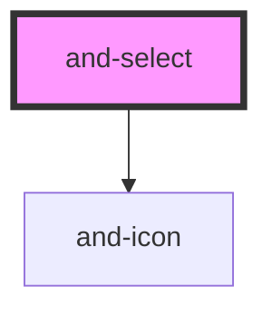

# and-select

<!-- Auto Generated Below -->

## Properties

| Property        | Attribute        | Description                                                                                                                              | Type                          | Default              |
| --------------- | ---------------- | ---------------------------------------------------------------------------------------------------------------------------------------- | ----------------------------- | -------------------- |
| `customClass`   | `class`          | Additional CSS classes from the consumer.                                                                                                | `string`                      | `undefined`          |
| `describedBy`   | `described-by`   | ID of element describing this field (e.g. helper or error text).                                                                         | `string`                      | `undefined`          |
| `disabled`      | `disabled`       | Disables interaction when true.                                                                                                          | `boolean`                     | `false`              |
| `hasError`      | `has-error`      | Whether the select is in an error state.                                                                                                 | `boolean`                     | `false`              |
| `label`         | `label`          | Accessible label for the select (used when no visible label exists).                                                                     | `string`                      | `undefined`          |
| `menuPlacement` | `menu-placement` | Menu placement strategy. - `auto`: chooses top/bottom based on viewport space - `bottom`: always opens below - `top`: always opens above | `"auto" \| "bottom" \| "top"` | `'auto'`             |
| `name`          | `name`           | Name attribute forwarded to native select.                                                                                               | `string`                      | `undefined`          |
| `options`       | --               | Options rendered in the select menu.                                                                                                     | `SelectOption[]`              | `[]`                 |
| `placeholder`   | `placeholder`    | Placeholder shown when no value is selected.                                                                                             | `string`                      | `'Select an option'` |
| `required`      | `required`       | Marks the field as required.                                                                                                             | `boolean`                     | `false`              |
| `value`         | `value`          | Current selected value.                                                                                                                  | `string`                      | `''`                 |

## Events

| Event             | Description                          | Type                  |
| ----------------- | ------------------------------------ | --------------------- |
| `andBlur`         | Emitted when select loses focus.     | `CustomEvent<void>`   |
| `andSelectChange` | Emitted when selected value changes. | `CustomEvent<string>` |

## Dependencies

### Depends on

- [and-icon](../and-icon)

### Graph

----------------------------------------------

*Built with [StencilJS](https://stenciljs.com/)*
