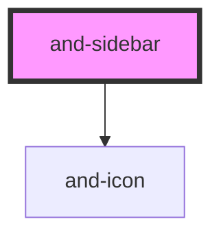

# and-sidebar

<!-- Auto Generated Below -->

## Properties

| Property           | Attribute           | Description                                                                                                                                                                                                                                                                                                             | Type                                             | Default                |
| ------------------ | ------------------- | ----------------------------------------------------------------------------------------------------------------------------------------------------------------------------------------------------------------------------------------------------------------------------------------------------------------------- | ------------------------------------------------ | ---------------------- |
| `activeItem`       | `active-item`       | The active navigation item ID.                                                                                                                                                                                                                                                                                          | `string`                                         | `'home'`               |
| `ariaNavLabel`     | `aria-nav-label`    | ARIA label for the navigation                                                                                                                                                                                                                                                                                           | `string`                                         | `'Sidebar navigation'` |
| `collapsed`        | `collapsed`         | Whether the sidebar is collapsed (desktop).                                                                                                                                                                                                                                                                             | `boolean`                                        | `false`                |
| `collapsedWidth`   | `collapsed-width`   | Collapsed width of the sidebar. Accepts any CSS value.                                                                                                                                                                                                                                                                  | `string`                                         | `'4rem'`               |
| `expandedWidth`    | `expanded-width`    | Expanded width of the sidebar. Accepts any CSS value.                                                                                                                                                                                                                                                                   | `string`                                         | `'16rem'`              |
| `itemVariant`      | `item-variant`      | Visual style for individual sidebar items. Controls how each item looks, independent of the sidebar container variant. Border-radius is intentionally not set — the theme controls it.  - `default`   — subtle accent bg on active - `underline` — left accent bar on active - `filled`    — solid primary bg on active | `"default" \| "filled" \| "underline"`           | `'default'`            |
| `items`            | `items`             | Navigation items to display. Items with `section: 'bottom'` render in the footer area.                                                                                                                                                                                                                                  | `SidebarItem[] \| string`                        | `[]`                   |
| `mobileBreakpoint` | `mobile-breakpoint` | Breakpoint (px) below which the sidebar auto-collapses on mobile.                                                                                                                                                                                                                                                       | `number`                                         | `768`                  |
| `mobileCollapse`   | `mobile-collapse`   | Enable auto-collapse on mobile viewports. When true, the sidebar collapses to icon-only mode on screens smaller than `mobileBreakpoint`.                                                                                                                                                                                | `boolean`                                        | `true`                 |
| `variant`          | `variant`           | Visual variant of the sidebar.                                                                                                                                                                                                                                                                                          | `"default" \| "filled" \| "floating" \| "glass"` | `'default'`            |

## Events

| Event                 | Description                                      | Type                   |
| --------------------- | ------------------------------------------------ | ---------------------- |
| `andSidebarItemClick` | Emitted when a navigation item is clicked.       | `CustomEvent<string>`  |
| `andSidebarToggle`    | Emitted when the sidebar collapse state changes. | `CustomEvent<boolean>` |

## Dependencies

### Depends on

- [and-icon](../and-icon)

### Graph

----------------------------------------------

*Built with [StencilJS](https://stenciljs.com/)*
