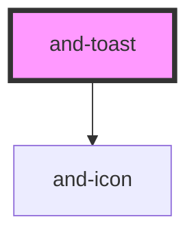

# and-toast

<!-- Auto Generated Below -->

## Properties

| Property   | Attribute  | Description                                | Type                                                                                              | Default          |
| ---------- | ---------- | ------------------------------------------ | ------------------------------------------------------------------------------------------------- | ---------------- |
| `position` | `position` | Position of the toast container on screen. | `"bottom-center" \| "bottom-left" \| "bottom-right" \| "top-center" \| "top-left" \| "top-right"` | `'bottom-right'` |

## Methods

### `present(message: string, type?: ToastType, duration?: number) => Promise<number>`

Present a new toast notification.

#### Parameters

| Name       | Type                                                       | Description |
| ---------- | ---------------------------------------------------------- | ----------- |
| `message`  | `string`                                                   |             |
| `type`     | `"info" \| "error" \| "default" \| "success" \| "warning"` |             |
| `duration` | `number`                                                   |             |

#### Returns

Type: `Promise<number>`

## Dependencies

### Depends on

- [and-icon](../and-icon)

### Graph

----------------------------------------------

*Built with [StencilJS](https://stenciljs.com/)*
